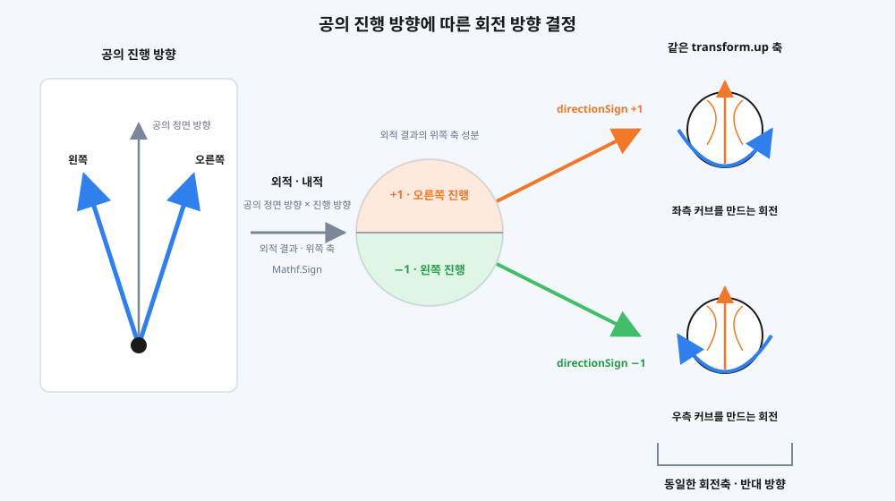
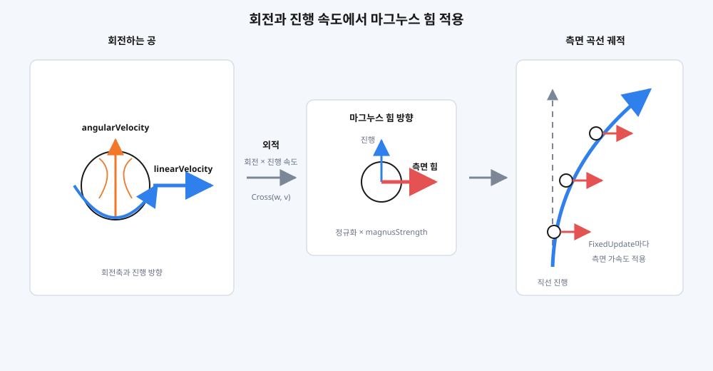

# AR BaseBallGame

모바일 AR 환경의 입력 편차를 정규화하고, 일관된 물리 결과로 변환하는 시스템을 구현한 프로젝트입니다.

> ㅎㅎㅇㅇㅇㅌ · **Unity6 12th ARProject Team4**  
> Reference: **컴투스 프로야구**

---

## 프로젝트 개요

Unity AR Foundation 기반 모바일 AR 야구 시뮬레이션입니다.  
AR 카메라로 평면을 인식해 경기장을 배치하고, 실제 공간에서 투수/타자 모드로 플레이합니다.

- **팀 구성** : 황해원(팀장 / AR 인식), **오융택(본인 / 야구 게임 로직·시스템)**
- **개발 기간** : 2025.06.16 ~ 2025.06.27 (12일)
- **테스트 기기** : Galaxy S20 Ultra / Galaxy Jump 2
- **팀 레포지토리** : [BIT-Unity12th-XRProjects/ARBaseBallGame](https://github.com/BIT-Unity12th-XRProjects/ARBaseBallGame)
- **포트폴리오** : [[Unity6] AR 야구 시뮬레이션](https://cyphen156.tistory.com/461)

---

## 수행 역할

팀 프로젝트로, 야구 게임 로직과 시스템 전반을 담당했습니다.

- 입력 파이프라인
  - 드래그 입력 정규화
  - 규칙 기반 UI 입력 이벤트 처리
- 충돌 기반 타격 물리 시스템
- 마그누스 효과 기반 투구 물리

---

## 주요 시스템

### 입력 파이프라인

드래그 조작과 UI 입력을 각각 게임에서 사용하는 값과 명령으로 변환해 전달하는 입력 처리 프로세스입니다.

- 입력을 **드래그 조작과 UI 입력의 두 경로로 구분**해 각각 게임에서 사용하는 값과 명령으로 변환
- 드래그 입력은 기기 환경에 따른 편차를 보정한 뒤 **방향과 세기로 분리해 전달**
- UI 입력은 버튼과 토글을 **게임 명령으로 변환해 상태 변경 요청으로 전달**

#### 드래그 입력 정규화

기기 화면 환경과 시작 위치가 달라도 일관된 조작 체감을 유지하기 위해, 드래그를 방향과 세기로 정규화하는 기능입니다.

- 해상도와 종횡비에 따른 축 차이를 보정해 동일한 기준의 방향 벡터로 변환
- 입력 시간은 방향 보정과 분리해 세기 값으로 변환

| 비교 항목 | FHD | PortableFHD |
|:---:|:---:|:---:|
| **해상도 차이** |  |  |
| **드래그 길이** |  |  |
| **시작 포지션 비교** |  |  |
| **입력 시간 비교** |  |  |

##### 정규화 처리 흐름도

#### 규칙 기반 UI 입력 이벤트 처리

UI 요소의 이름을 `PlayMode`, `Command`, `PitchType`으로 변환하고, 입력 유형에 맞는 게임 상태 변경 요청으로 전달하는 기능입니다.

- 시스템 버튼은 단일 클릭 이벤트에서 오브젝트 이름을 판별해 `PlayMode` 또는 `Command`로 변환
- 구종 토글은 이름을 `PitchType`과 연결하고, 선택 변경을 이벤트로 전달
- 변환된 입력은 `UIManager`가 유형별 요청으로 분기해 `GameManager`에 전달

---

### 마그누스 효과 기반 투구 물리

드래그의 좌우 성분은 마그누스 힘의 방향으로, 상하 성분은 Rigidbody가 받는 중력 방향으로 변환해 네 방향의 커브를 만드는 시스템입니다.

#### 좌우 회전 방향 결정

공의 정면 방향과 진행 방향의 관계에서 좌우 부호를 구하고, 동일한 회전축에 적용해 회전 방향을 결정하는 기능입니다.

| 연산 | 사용하는 값 | 얻는 값 |
|---|---|---|
| 외적 | 공의 정면 방향 · 진행 방향 | 두 방향에 수직인 벡터 |
| 내적 · 부호 | 외적 결과 · 월드 위쪽 축 | 좌우를 구분하는 `+1 / −1` |
| 부호 적용 | 기본 회전축 · 좌우 부호 | 같은 축에서 반전되는 `angularVelocity` |

#### 마그누스 힘 적용

회전 속도와 진행 속도를 외적해 공의 진행 방향에 수직인 힘의 방향을 구하고, 고정된 세기의 가속도로 적용합니다.

- `angularVelocity × linearVelocity`를 정규화해 마그누스 힘의 방향 계산
- 고정된 `magnusStrength`를 곱해 `Rigidbody.AddForce`로 가속도 적용

#### Rigidbody 기반 상하 궤적

상하 입력에 따라 Rigidbody가 받는 중력 방향을 전환해, 별도의 궤적 보간 없이 자연스러운 상승과 하강을 만드는 기능입니다.

| 상하 입력 | Rigidbody 중력 | 궤적 변화 |
|---|---|---|
| 위 | `−9.81 × 0.3` 기본 중력 | 하강 커브 |
| 아래 | `−9.81 × −0.2` 역중력 | 상승 커브 |

- 기본 중력은 줄여 짧은 AR 투구 거리에서도 커브가 형성될 시간 확보
- 아래 방향 입력은 중력을 반전해 Rigidbody가 상승 궤적을 생성
- 좌우 마그누스 방향과 상하 중력 방향을 조합해 네 방향으로 분기

---

### 충돌 기반 타격 물리 시스템

배트의 충돌 위치와 스윙 시점에 따라 전달 힘을 계산하고, 공의 기존 속도를 배트 방향 기준으로 반사해 타구를 만드는 시스템입니다.

| 타격 위치 비교 | 케이스 1 | 케이스 2 |
|:---:|:---:|:---:|
| **정면 · 타구 방향** |  |  |
| **측면 · 충돌 위치** |  |  |

#### 배트의 분할 콜라이더

배트를 여러 Collider로 분할하고, 공과 충돌한 Collider의 위치를 타격 가중치로 변환하는 기능입니다.

| 처리 | 기준 |
|---|---|
| 충돌 위치 | 충돌한 Collider의 배열 인덱스 |
| 위치 가중치 | 인덱스를 `0.3 / 0.8 / 1.3` 범위로 변환 |
| 스윙 시점 | 스윙 시작 후 경과 시간 |
| 전달 힘 | 입력 세기 × 위치 가중치 × 스윙 경과 시간 |

- 배트는 애니메이션을 따라 움직이고, 공의 Rigidbody가 Collider 충돌을 감지
- 회전축에서 먼 위치일수록 높은 가중치를 적용해 타격 위치에 따른 힘의 차이 구성
- 스윙 경과 시간을 함께 반영해 같은 위치에서도 충돌 시점에 따라 전달 힘이 달라짐

#### 공의 반사 방향과 최종 속력

공의 기존 진행 방향을 배트 방향 기준으로 반사하고, 전달 힘과 기존 속력을 합쳐 최종 타구를 만드는 기능입니다.

| 결과 | 처리 |
|---|---|
| 타구 방향 | 공의 기존 진행 방향을 전달된 배트 방향 기준으로 반사 |
| 타구 속력 | 전달 힘 + 공의 기존 속력 |
| 최종 속도 | 반사 방향 × `Clamp(타구 속력, 0, 80)` |

- 타구 방향은 배트 방향만으로 고정하지 않고 충돌 직전 공의 진행 방향을 함께 반영
- 타구 속력에는 공이 이미 가지고 있던 속력을 유지해 투구 상태가 타격 결과로 연결

#### 타격 가능 영역

스윙 애니메이션이 배트의 이동 경로와 도달 범위를 만들고, 입력의 세로 성분이 그 경로를 지나는 배트 기울기를 결정하는 기능입니다.

| 담당 | 정하는 것 |
|---|---|
| 애니메이션 | 스윙 경로 · 속도 · 배트가 닿는 범위 |
| 드래그 세로 성분 | 스윙 시작 시 배트 기울기 (`±22.5°`) |
| 분할 Collider | 실제 공과 접촉할 수 있는 타격 영역 |

- 입력 방향은 스윙 시작 시 확정되며 진행 중에는 변경하지 않음
- 같은 정규화 방향을 투수 모드에서는 투구 방향, 타자 모드에서는 배트 기울기로 해석

---

## 사후 개선점

입력 자체는 화면 크기와 비율을 기준으로 정규화했지만, **입력이 적용되는 AR 공간은 정규화하지 않았습니다.**

AR Plane 배치 시 Raycast 지점에 따라 카메라와 경기장 간 거리가 달라지면서, 월드 스케일 자체가 매번 다르게 형성됩니다.  
이로 인해 동일한 물리력이라도 투구 체감이 경기장 배치 상황에 따라 다르게 나타납니다.

| 방법 | 기준 | 특징 | 리스크 |
|---|---|---|---|
| **월드 스케일 정규화** | 물리 일관성 | AR Raycast 거리 기준 월드 스케일 동적 조정 | 메시·콜라이더 스케일 불안정 가능성 |
| **동적 물리력 보정** | 공간 안정성 | 카메라-스트라이크존 거리 비례 물리력·마그누스 힘 실시간 스케일링 | 물리력 일관성 관리 어려움, 연산 비용 증가 |

---

## 기술 스택

| 항목 | 내용 |
|---|---|
| 엔진 | Unity 6 (6.0.34f1) |
| 언어 | C# |
| AR | AR Foundation |
| 입력 | Unity Input System |
