# AR BaseBallGame

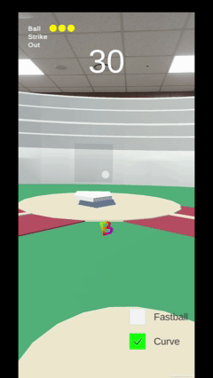
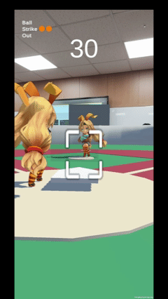

> 팀 레포지토리 : [BIT-Unity12th-XRProjects/ARBaseBallGame](https://github.com/BIT-Unity12th-XRProjects/ARBaseBallGame)

---

## 프로젝트 소개

### Unity의 **AR Foundation**으로 만든 **모바일 AR 야구 시뮬레이션**입니다.

스마트폰 AR 카메라로 **평면(Plane)** 을 인식해 경기장을 배치하고, 실제 공간에서 **투수/타자 모드**로 플레이합니다.  
드래그 제스처를 **힘·방향·타이밍**으로 정규화해 **투구/스윙**에 매핑하고, **마그누스 효과**와 **배트 반사 물리**로 현실감 있는 궤적과 타격감을 구현했습니다.

- **팀 구성** : 황해원(팀장 / AR 인식), **오융택(본인 / 야구 게임 로직·시스템)**
- **개발 기간** : 2025.06.16 ~ 2025.06.27 (12일)
- **기획 의도** : 일상 공간에서 바로 즐기는 캐주얼 야구 체험
- **테스트 기기** : Galaxy S20 Ultra / Galaxy Jump 2
- **포트폴리오** : [[Unity6] AR 야구 시뮬레이션](https://cyphen156.tistory.com/461)

---

## 수행 역할

팀 프로젝트로, 야구 게임 로직과 시스템 전반을 담당했습니다.

- 드래그 입력 → 화면 비율 기반 정규화 → 물리력 변환 파이프라인 설계 및 구현
- 마그누스 효과 기반 투구 물리 구현 (직구 / 커브)
- 배트 충돌 기반 타격 반사 시스템 설계 및 구현
- 버튼 이름 → enum 파싱 기반 UI 이벤트 중앙 라우팅 구조 설계
- 턴제 볼카운트 · 아웃카운트 처리 구현

---

## 구현한 기능

- **게임 루프** : `Init → Ready → Play → End`, 타자/투수 모드 선택, 라운드/타이머 운영
- **투수 모드** : 구종(직구/커브) 선택 → 드래그 기반 힘·방향·타이밍 산출 → `Shoot`
- **타자 모드** : 드래그 스윙 → 배트 충돌 반사 벡터 계산(타격 위치, 스윙 가속도) → 파울/안타/홈런 판정
- **물리·판정** : 마그누스 효과(커브), 반사
- **UI 반영** : 모드별 HUD, 스트라이크 존, 타이머/카운트/스코어 실시간 갱신

---

## 핵심 설계

### 입력 파이프라인

AR 환경에서는 경기장 배치(탭), 게임 플레이(드래그), UI 버튼 입력이 모두 같은 화면에서 발생합니다.
입력 수집과 해석의 책임을 분리하고, 모든 입력이 GameManager를 거쳐 처리되는 단일 파이프라인으로 설계했습니다.
GameState를 기준으로 해석을 분기하기 때문에 입력 종류가 늘어나도 분기 기준은 한 곳에서만 관리됩니다.
모바일 환경에서는 기기마다 화면 해상도와 종횡비가 달라, 같은 물리적 드래그 거리도 픽셀값이 다르게 측정됩니다.
픽셀값을 그대로 물리력으로 변환하면 기기마다 다른 투구 결과가 나오는 구조가 됩니다. 
이를 해결하기 위해 드래그 입력을 Screen.width / Screen.height로 나눠 0~1 사이의 비율값으로 정규화하고, screenRatio로 종횡비를 보정한 뒤 카메라 기준 월드 방향 벡터로 변환하는 구조를 설계했습니다. 
```
드래그 입력 → PlayerController → GameManager.ProcessInput() → Pitcher / Bat
버튼 입력  → Button Name → Enum 파싱 → UIManager → GameManager
```

| 비교 항목 | 기준 | 비교 |
|:---:|:---:|:---:|
| **해상도 차이 보정** | 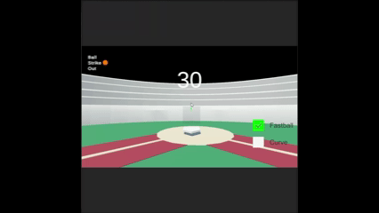 | 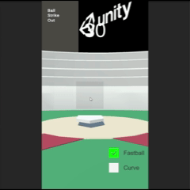 |
| **드래그 길이 정규화** | 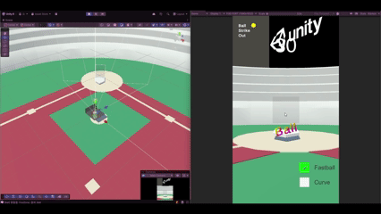 | 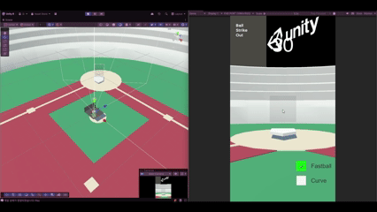 |
| **시작 포지션 비교** (비율에 의한 벡터 산출) |  | 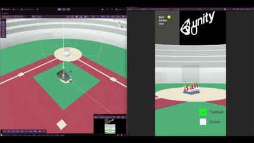 |
| **입력 시간 비교** (가속도 변환) |  |  |

---

### 배트 반사 물리
투수와 동일한 입력 파이프라인을 거치기 때문에, 드래그 방향에 따라 정규화된 방향 벡터가 배트 스윙 방향으로 전달되고 배트가 휘둘러지는 각도가 달라집니다.
타격 결과를 미리 정의된 방향으로 매핑하지 않고,
충돌 시점의 물리 정보(입사 벡터·충돌 법선·배트 속도)를 기반으로 반사 벡터를 계산하는 일반화된 구조로 구현했습니다.
배트 콜라이더를 분할하고 위치별 가중치를 적용해 타격 위치와 스윙시 배트에 전달된 물리력에 따라 다른 타구 결과가 발생합니다.
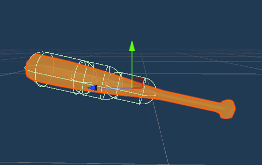 

| 비교 항목 | 케이스 1 | 케이스 2 |
|:---:|:---:|:---:|
| **히트 위치에 따른 반사 비교** | 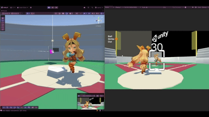 | 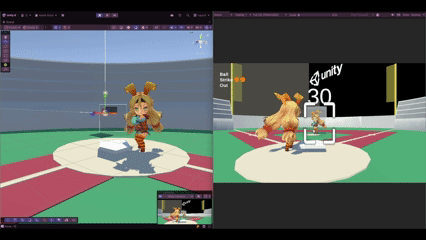 |
| **측면 히트포인트 비교** | 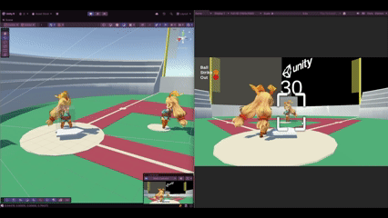 | 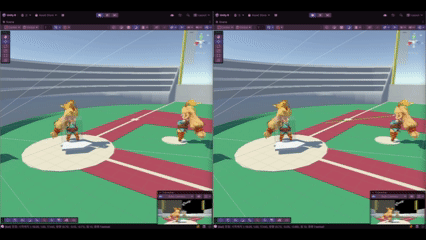 |

---

### 마그누스 효과 적용
AR 월드 스케일은 실제 물리 스케일보다 훨씬 작기 때문에, Unity Physics 기본 중력을 그대로 적용하면 공이 순식간에 바닥으로 떨어집니다. 
중력값을 줄여 공이 적당히 날아가도록 보정했고, 아래 방향 커브의 경우 중력을 역방향으로 적용해 위로 꺾이는 궤적을 구현했습니다.
마그누스 힘도 동일한 이유로 수식 그대로 적용하면 공의 이동 시간이 짧아 궤적 변화가 유저에게 직구처럼 인지됩니다. 
시각적 피드백을 최우선으로 magnusStrength를 강제로 스케일업해 게임적 허용을 제공하여 커브 궤적이 명확히 구분되도록 하여 유저 경험을 극대화 하였습니다.

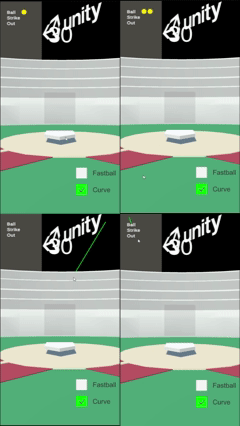

```csharp
// Ball.cs — 투구 방향 기반 스핀 축 결정 + 중력 역보정
private void ApplySpin(PitchType type)
{
    switch (type)
    {
        case PitchType.Fastball:
            rb.angularVelocity = transform.right * -30f; // Backspin
            rb.useGravity = false;
            break;
        case PitchType.Curve:
            Vector3 cross = Vector3.Cross(transform.forward, _direction);
            float side = Vector3.Dot(cross, Vector3.up);        // 좌/우 판별
            float directionSign = Mathf.Sign(side);             // +1 Curve Left / -1 Curve Right
            float verticalFlip = Mathf.Sign(_direction.y);
            Vector3 spinAxis = transform.up;
 
            if (verticalFlip < 0)                               // 아래로 던질 때 스핀 축 플립 + 중력 역보정
            {
                spinAxis = Vector3.Reflect(spinAxis, transform.right);
                Physics.gravity = _flippedGravity;
            }
 
            float forceFactor = Mathf.InverseLerp(1f, 10f, _force);
            float finalSpin = Mathf.Lerp(1f, 2.5f, forceFactor); // 투구 힘에 비례한 스핀 세기
 
            rb.angularVelocity = spinAxis * directionSign * -finalSpin * 0.8f;
            break;
    }
}
 
// Ball.cs — 마그누스 힘 + 공기 저항 수동 적용
private void FixedUpdate()
{
    if (_pitchType == PitchType.Curve)
    {
        Vector3 w = rb.angularVelocity;
        Vector3 v = rb.linearVelocity;
 
        if (w != Vector3.zero && v != Vector3.zero)
        {
            Vector3 magnusForce = Vector3.Cross(w, v).normalized * magnusStrength;
            rb.AddForce(magnusForce, ForceMode.Acceleration);
        }
    }
 
    rb.linearVelocity *= (1f - _resistance * Time.fixedDeltaTime); // 공기 저항 수동 적용
}
```

---

## 사후 개선점

입력 정규화는 화면 공간 기준으로는 성공했지만, 월드 공간 기준 거리 보정이 빠져있었습니다.

AR 경기장은 사용자가 배치하는 시점에 카메라와 스트라이크존 사이의 월드 거리가 결정됩니다. 
그러나 `ProcessInput`의 force 계산은 드래그 시간 기반으로만 처리되어 이 거리를 반영하지 않습니다. 
결과적으로 경기장을 가까이 배치하면 공이 너무 빠르게, 멀리 배치하면 너무 약하게 느껴지는 체감 편차가 발생했습니다.

현재 고려하고 있는 개선 방은 두 가지입니다.

- **방법 A — 월드 스케일 정규화** : 경기장 생성 시점의 AR Raycast 거리를 기준으로 월드 스케일 자체를 보정해 동일한 물리력이 동일한 체감으로 작용하도록 한다.
- **방법 B — force 스케일 보정** : 카메라-스트라이크존 거리를 측정해 `ProcessInput`의 force 값에 보정값으로 직접 반영한다.

---

## 기술 스택

| 항목 | 내용 |
|---|---|
| 엔진 | Unity 6 (6.0.34f1) |
| 언어 | C# |
| AR | AR Foundation |
| 입력 | Unity Input System |
