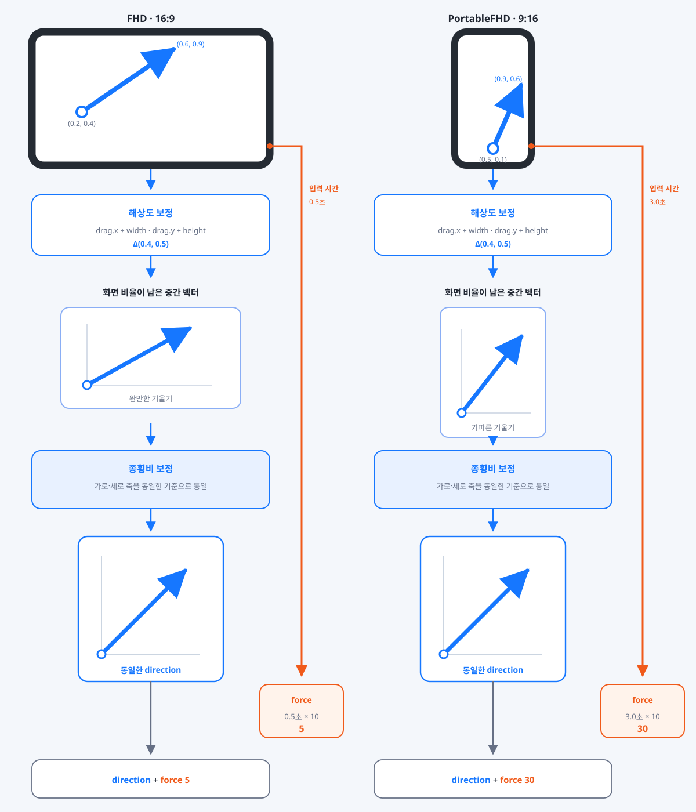

# AR BaseBallGame

모바일 AR 환경의 입력 편차를 정규화하고, 일관된 물리 결과로 변환하는 시스템을 구현한 프로젝트입니다.


> ㅎㅎㅇㅇㅇㅌ · **Unity6 12th ARProject Team4**  
> Reference: **컴투스 프로야구**

---

## 프로젝트 개요

Unity AR Foundation 기반 모바일 AR 야구 시뮬레이션입니다.  
AR 카메라로 평면을 인식해 경기장을 배치하고, 실제 공간에서 투수/타자 모드로 플레이합니다.

- **팀 구성** : 황해원(팀장 / AR 인식), **오융택(본인 / 야구 게임 로직·시스템)**
- **개발 기간** : 2025.06.16 ~ 2025.06.27 (12일)
- **테스트 기기** : Galaxy S20 Ultra / Galaxy Jump 2
- **팀 레포지토리** : [BIT-Unity12th-XRProjects/ARBaseBallGame](https://github.com/BIT-Unity12th-XRProjects/ARBaseBallGame)
- **포트폴리오** : [[Unity6] AR 야구 시뮬레이션](https://cyphen156.tistory.com/461)

---

## 수행 역할

팀 프로젝트로, 야구 게임 로직과 시스템 전반을 담당했습니다.

- 입력 파이프라인
  - 드래그 입력 정규화
  - 규칙 기반 UI 입력 이벤트 처리
- 충돌 기반 타격 물리 시스템
- 마그누스 효과 기반 투구 물리

---

## 주요 시스템

### 입력 파이프라인

드래그 조작과 UI 입력을 각각 게임에서 사용하는 값과 명령으로 변환해 전달하는 입력 처리 프로세스입니다.


- 입력을 **드래그 조작과 UI 입력의 두 경로로 구분**해 각각 게임에서 사용하는 값과 명령으로 변환
- 드래그 입력은 기기 환경에 따른 편차를 보정한 뒤 **방향과 세기로 분리해 전달**
- UI 입력은 버튼과 토글을 **게임 명령으로 변환해 상태 변경 요청으로 전달**

#### 드래그 입력 정규화

기기 화면 환경과 시작 위치가 달라도 일관된 조작 체감을 유지하기 위해, 드래그를 방향과 세기로 정규화하는 기능입니다.

- 해상도와 종횡비에 따른 축 차이를 보정해 동일한 기준의 방향 벡터로 변환
- 입력 시간은 방향 보정과 분리해 세기 값으로 변환

| 비교 항목 | FHD | PortableFHD |
|:---:|:---:|:---:|
| **해상도 차이** |  |  |
| **드래그 길이** |  |  |
| **시작 포지션 비교** |  |  |
| **입력 시간 비교** |  |  |



#### 규칙 기반 UI 입력 이벤트 처리

UI 요소의 이름을 `PlayMode`, `Command`, `PitchType`으로 변환하고, 입력 유형에 맞는 게임 상태 변경 요청으로 전달하는 기능입니다.

- 시스템 버튼은 단일 클릭 이벤트에서 오브젝트 이름을 판별해 `PlayMode` 또는 `Command`로 변환
- 구종 토글은 이름을 `PitchType`과 연결하고, 선택 변경을 이벤트로 전달
- 변환된 입력은 `UIManager`가 유형별 요청으로 분기해 `GameManager`에 전달
  
---

### 충돌 기반 타격 물리 시스템

타격 위치와 스윙 입력에 따라 공의 반사 결과가 달라지도록 만드는 타격 물리 시스템입니다.

- 공의 진행 방향을 배트 기준으로 반사시켜 타구 방향을 결정합니다.
- 기존 속도에 타격 힘을 더해 반사 속도를 계산합니다.
- 타격 위치에 따라 가중값을 다르게 적용합니다.
- 누적된 타격 강도를 반사 계산에 반영합니다.


| 비교 항목 | 케이스 1 | 케이스 2 |
|:---:|:---:|:---:|
| **히트 위치에 따른 반사** |  |  |
| **측면 히트포인트** |  |  |

---

### 마그누스 효과 기반 투구 물리
 
사용자의 드래그 입력을 4방향 커브 궤적으로 시각화하는 투구 물리 시스템입니다.
 
- 드래그 방향을 통해 커브 방향을 결정합니다.
- 드래그 세기에 따라 커브의 강도를 조정합니다.
- 회전과 속도를 기반으로 마그누스 힘을 적용해 실제 궤적을 생성합니다.
- 아래 방향으로 드래그할 경우 역전된 중력을 적용해 공이 위로 상승하는 커브 궤적을 만듭니다.
 


```csharp
// Ball.cs — 투구 방향 기반 스핀 축 결정 + 중력 역보정
private void ApplySpin(PitchType type)
{
    switch (type)
    {
        case PitchType.Fastball:
            rb.angularVelocity = transform.right * -30f;
            rb.useGravity = false;
            break;
        case PitchType.Curve:
            Vector3 cross = Vector3.Cross(transform.forward, _direction);
            float side = Vector3.Dot(cross, Vector3.up);
            float directionSign = Mathf.Sign(side);
            float verticalFlip = Mathf.Sign(_direction.y);
            Vector3 spinAxis = transform.up;

            if (verticalFlip < 0)
            {
                spinAxis = Vector3.Reflect(spinAxis, transform.right);
                Physics.gravity = _flippedGravity;
            }

            float forceFactor = Mathf.InverseLerp(1f, 10f, _force);
            float finalSpin = Mathf.Lerp(1f, 2.5f, forceFactor);
            rb.angularVelocity = spinAxis * directionSign * -finalSpin * 0.8f;
            break;
    }
}

// Ball.cs — 마그누스 힘 + 공기 저항 수동 적용
private void FixedUpdate()
{
    if (_pitchType == PitchType.Curve)
    {
        Vector3 w = rb.angularVelocity;
        Vector3 v = rb.linearVelocity;

        if (w != Vector3.zero && v != Vector3.zero)
        {
            Vector3 magnusForce = Vector3.Cross(w, v).normalized * magnusStrength;
            rb.AddForce(magnusForce, ForceMode.Acceleration);
        }
    }
    rb.linearVelocity *= (1f - _resistance * Time.fixedDeltaTime);
}
```

---

## 사후 개선점

AR Plane 배치 시 Raycast 지점에 따라 카메라와 경기장 간 거리가 달라지면서, 월드 스케일 자체가 매번 다르게 형성됩니다.  
이로 인해 동일한 물리력이라도 투구 체감이 경기장 배치 상황에 따라 다르게 나타납니다.

 이 문제를 해결하기 위해 두 가지 접근을 검토 중입니다.

| 방법 | 기준 | 특징 | 리스크 |
|---|---|---|---|
| **월드 스케일 정규화** | 물리 일관성 | AR Raycast 거리 기준 월드 스케일 동적 조정  | 메시·콜라이더 스케일 불안정 가능성 |
| **동적 물리력 보정** | 공간 안정성 | 카메라-스트라이크존 거리 비례 물리력·마그누스 힘 실시간 스케일링 | 물리력 일관성 관리 어려움, 연산 비용 증가 |
 
---

## 기술 스택

| 항목 | 내용 |
|---|---|
| 엔진 | Unity 6 (6.0.34f1) |
| 언어 | C# |
| AR | AR Foundation |
| 입력 | Unity Input System |
